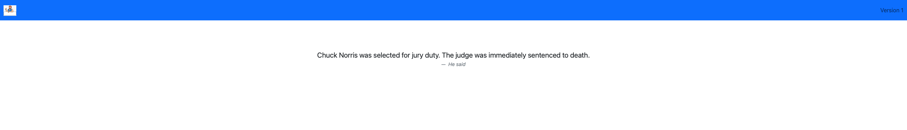

## Introduction
In this part you will perform the following tasks:
- Create Flux Kustomization
- Check the difference between the dev and production in the Kubernetes cluster
- Deploy Chuck Norris app version 1 into dev and prod
- Test Chuck Norris App version 1

## Create Flux Kustomization
The Kustomization custom resource represents a local set of Kubernetes resources (e.g. Kustomize overlay) that Flux is supposed to reconcile in the cluster.

The reconciliation runs every one minute by default, but this can be changed with `.spec.interval`. If you make any changes to the cluster using `kubectl` apply/edit/patch/delete, they will be promptly reverted. You either suspend the reconciliation or push your changes to a Git repository.

`Dev` GitRepositories that you have created earlier contains the Kustomize overlays for both environments. Within each GitRepository, the path to the Kustomize overlay will vary. For `dev` environment (`CLUS2022-DEVWKS-2998` repository `dev` branch), the path is `env/dev`. For `prod` environment (`CLUS2022-DEVWKS-2998` repository `main` branch), the path is `env/prod`.

Let's create the corresponding Kustomization resources and start with `prod` environment. Run the following command:
```bash
flux create kustomization prod \
--source prod \
--path env/prod \
--target-namespace prod \
--prune true \
--interval 1m \
--export \
| tee -a apps/prod.yaml
```

You should see this:
```yaml
apiVersion: kustomize.toolkit.fluxcd.io/v1beta2
kind: Kustomization
metadata:
  name: prod
  namespace: flux-system
spec:
  interval: 10m0s
  path: ./env/prod
  prune: true
  sourceRef:
    kind: GitRepository
    name: prod
  targetNamespace: default
```

For `dev` environment, execute the following command:
```bash
flux create kustomization dev \
--source dev \
--path env/dev \
--target-namespace dev \
--prune true \
--interval 1m \
--export \
| tee -a apps/dev.yaml
```

You should see this:
```yaml
apiVersion: kustomize.toolkit.fluxcd.io/v1beta2
kind: Kustomization
metadata:
  name: dev
  namespace: flux-system
spec:
  interval: 10m0s
  path: ./env/dev
  prune: true
  sourceRef:
    kind: GitRepository
    name: dev
  targetNamespace: dev
```

Let’s check `natilik-fleet` repository structure:
```bash
tree /home/developer/src/natilik-fleet
```

```
/root/natilik-fleet
└── clusters
    └── clus2022
        ├── apps
        │   ├── dev.yaml
        │   └── prod.yaml
        └── flux-system
            ├── gotk-components.yaml
            ├── gotk-sync.yaml
            └── kustomization.yaml
```

What you have done so far is only creating a set of local YAML files to configure Flux. The next step is to commit these files to the remote Git repository. As soon as Flux "see" the new configuration in `CLUS2022-DEVWKS-2998` repository it will start deploying the application in our `dev` and `prod` environments. Let's push the changes to the repository by running the following command:
```bash
git add .
git commit -m "Deploy Chuck Norris App"
git push
```

Flux will use the Kustomize overlays to reconcile the application in `dev` and `prod` environments. Run the following command to monitor the status of the reconciliation:
```bash
flux get kustomization
```

You should see this:
```
NAME    READY   MESSAGE                                 REVISION        SUSPENDED
prod    True    Applied revision: master/c2a2124        master/c2a2124  False
dev     True    Applied revision: dev/87b7a84   dev/87b7a84     False
flux-system     True    Applied revision: main/eadcb6c  main/eadcb6c    False
```

You can also check new Flux Git sources by running the following command:
```bash
flux get source git
```

```
NAME            READY   MESSAGE                                 REVISION        SUSPENDED
dev             True    Fetched revision: dev/87b7a84           dev/87b7a84     False
flux-system     True    Fetched revision: main/eadcb6c          main/eadcb6c    False
prod            True    Fetched revision: master/c2a2124        master/c2a2124  False
```

Let's monitor the deployment of the application by running the following commands:

In `dev` namespace:
```bash
kubectl get po -n dev
```

```
NAME                                READY   STATUS    RESTARTS   AGE
chuck-norris-app-79fdbc9769-557lp   1/1     Running   0          61s
```

In `prod` namespace:
```bash
kubectl get po -n prod
```

```
NAME                                READY   STATUS    RESTARTS   AGE
chuck-norris-app-79fdbc9769-fhrnd   1/1     Running   0          10m
```

We will be accessing Chuck Norris App via proxy. You will be able to access both services via these two links:


Before we will validate Consul and Grafana let's make sure Caddy is running.
```bash
cd /home/developer/src
caddy stop
caddy run
```

Now, let's check that the application is working. Open two new tabs. In the first tab run:
```bash
kubectl port-forward service/chuck-norris-app 8090:8080 -n prod
```
Open Chuck Norris App in `prod` environment via the first link. Link should be something like this: `https://app-8080-xxxx.devenv-testing.ap-ne-1.devnetcloud.com`.

In the second tab run:
```bash
kubectl port-forward service/chuck-norris-app 8091:8080 -n dev
```
Open Chuck Norris App Version in `dev` environment via the second link. Link should be something like this: `https://app-8081-xxxx.devenv-testing.ap-ne-1.devnetcloud.com`.

In both cases you should see this:



This is version 1 of our Chuck Norris app and it proves that we run version 1 in `prod` and `dev` environment.
