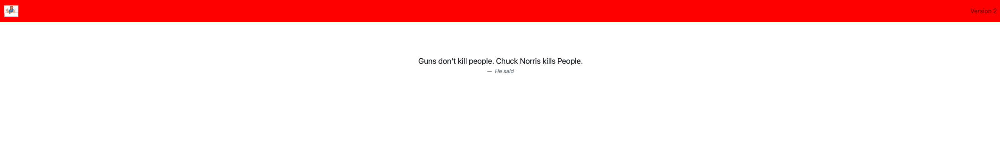

### Introduction

In this part you will perform the following tasks:

- Deploy Chuck Norris app version 2 in dev and test
- Deploy Chuck Norris app version 2 in prod


### Deploying new version manually

Let’s assume your developers would like to deploy new version of Chuck Norris app. The new version has been pushed by developers to Docker Hub container registry as `maty0609/clus2022-chuck-app:v2`

Now let’s deploy the new version in the real GitOps fashion. We don’t want to deploy version 2 straight into production so we will want to deploy new version in `dev` environment first. Let’s go into our Chuck Norris app repository and switch to `dev` branch.

```
cd /root/chuck-norris-app-clus2022
git checkout dev
```

We will change image name in the file `./env/dev/deployment.yaml` from `maty0609/clus2022-chuck-app:v1` to `maty0609/clus2022-chuck-app:v2`. The whole manifest should look like this:

```yaml
apiVersion: apps/v1
kind: Deployment
metadata:
  name: chuck-norris-app
  namespace: dev
spec:
  replicas: 1
  selector:
    matchLabels:
      app: chuck-norris-app
  template:
    metadata:
      labels:
        app: chuck-norris-app
    spec:
      containers:
      - image: maty0609/clus2022-chuck-app:v2
        name: chuck-norris-app
        imagePullPolicy: Always
        ports:
        - containerPort: 8080
      restartPolicy: Always
```

Now when we have changed the file `./env/dev/deployment.yaml` let’s push the changes:

```yaml
git add .
git commit -m "Deploy v2 in dev"
git push
```

Let’s check reconciliation

`flux get kustomization -w`

After the cluster has been reconciled we can check the new version running in `dev`. Access port `8081` and you should see our new version 2. It proves that we are now running version 2 in `dev` environment.



Everything looks great in `dev` environment so let’s change it in `prod` as well. We will change image name in the file `./app/prod.yaml`

```
cd /root/chuck-norris-app-clus2022
git checkout main
```

We will change image in the file `./env/prod/deployment.yaml` from `maty0609/clus2022-chuck-app:v1` to `maty0609/clus2022-chuck-app:v2`. The whole manifest should look like this:

```yaml
apiVersion: apps/v1
kind: Deployment
metadata:
  name: chuck-norris-app
  namespace: prod
spec:
  replicas: 1
  selector:
    matchLabels:
      app: chuck-norris-app
  template:
    metadata:
      labels:
        app: chuck-norris-app
    spec:
      containers:
      - image: maty0609/clus2022-chuck-app:v2
        name: chuck-norris-app
        imagePullPolicy: Always
        ports:
        - containerPort: 8080
      restartPolicy: Always
```

Now when we have changed the file `./env/prod/deployment.yaml` let’s push the changes:

```yaml
git add .
git commit -m "Deploy v2 in prod"
git push
```

Let’s check reconciliation

`flux get kustomization -w`

We can now check if the new version has been deployed in `prod`. Access port `8080` and you should see our new version 2.
